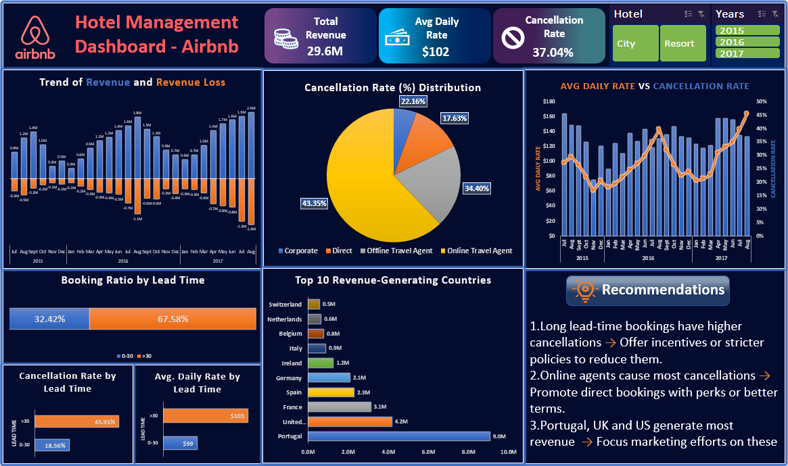

# Airbnb Booking Insights Dashboard: Revenue & Cancellation Analysis	

- Analyzed 100,000+ Airbnb booking records using Excel to calculate key KPIs including total revenue, average daily rate (ADR), and cancellation rate, enhancing business visibility.
- Explored booking behaviors by lead time and channels, identifying revenue trends, loss patterns, and cancellation drivers to derive actionable insights for revenue optimization.
- Built an interactive Excel dashboard with pivot tables, charts, and slicers (city, resort, year) to visualize performance trends and enable dynamic, data-driven decision-making.

